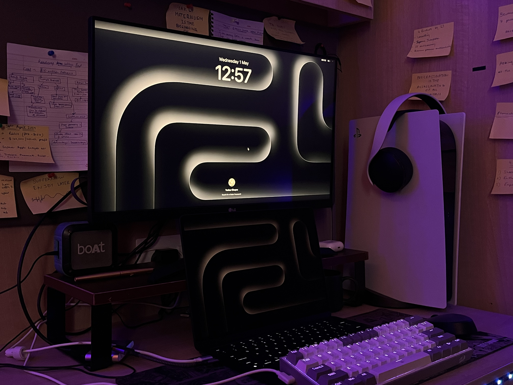

<h1 align="center">Hi, I'm Tushar</h1>
<h3 align="center">I'm currently a final year computer science student at Thapar University with a keen interest in DevOps, Fullstack development, Blockchain and Artificial Intelligence</h3>

## 🙋‍♂️ About Me

- 🔭 Worked as a Software Engineer at **[Subconscious.ai](https://www.subconscious.ai/)**
- 🔭 Worked as a Software Engineer Intern at **[Subconscious.ai](https://www.subconscious.ai/)**
- 🔭 Worked as a Frontend Engineer at **[Carmony](https://www.linkedin.com/company/carmonyinc/about/)**
- 🔭 Worked as a Web3 Developer Intern at **[Carmony](https://www.linkedin.com/company/carmonyinc/about/)**
- 🔭 Worked as a react native developer at **[Rasta](https://www.rasta.in/)**
- 🔭 I worked as a web dev intern at **[DigiTech Buds](https://digitechbuds.com/)**
- 🔭 I worked as a frontend developer and UI/UX design intern at **Lifesap**

- 🌱 I’m currently learning and working on

  - **Next.js**
  - **React.js**
  - **Rust**
  - **Advanced TypeScript**
  - **Web3js**
  - **Solidity**
  - **Node.js**
  - **Swift**

- 👯 I’m looking to collaborate on **OpenSource Projects**

- 📫 How to reach me **tusharchopra02122002@gmail.com**

- ⚡ Fun fact **I play video games and go to the GYM very often and read books play football and like to learn new things.**

## 🚀 Languages and Tools:

<table>

<table align="center">
  <tr>
    <td align="center" width="96">
        
       React
    </td>
    <td align="center" width="96">
      
       Python
    </td>
    <td align="center" width="96">
        
       JavaScript
    </td>
    <td align="center" width="96">
        
       C++
    </td>
    <td align="center" width="96">
        
       Webpack
    </td>
    <td align="center" width="96">
        
       MySQL
    </td>
    <td align="center" width="96">
        
       TypeScript
    </td>
    <td align="center" width="96">
        
       AWS
    </td>
    <td align="center" width="96">
        
       Swift
    </td>
  </tr>
  <tr>
  <td align="center" width="96">
        
       Redux
    <td align="center" width="96">
        
       Github
    </td>
    <td align="center" width="96"> 
        
       Git
    </td>
    <td align="center"  width="96">
        
       Kubernetes
    </td>
    <td align="center" width="96">
       
       Docker
    </td>
    <td align="center"  width="96">
        
       HTML5
    </td>
    <td align="center" width="96">
        
       CSS
    </td>
    <td align="center"  width="96">
        
       Bootstrap
    </td>
    <td align="center" width="96">
        
       jQuery
    </td>
  </tr>
 <tr>
      <td align="center" width="96">
        
       MongoDB
    </td>
        <td align="center" width="96">
        
       Nodejs
      </td>
      </td>
    <td align="center" width="96">
        
       Jenkins
    </td>
            <td align="center" width="96">
        
       VsCode
    </td>
              <td align="center" width="96">
        
       WordPress
    </td>
              <td align="center" width="96">
         
       Rust
  <td align="center" width="96">
      
       Nextjs
    </td>
              <td align="center" width="96">
        
       Java
    </td>
    <td align="center" width="96">
        
       PostgreSQL
    </td>
 </tr>
</table>
  
</table>

    

## 📊 My Github Stats

   
    
  
   
  <b>Note:</b> Top languages is only a metric of the languages my public code consists of and doesn't reflect experience or skill level.

 
 

 

## Connect with me:

## ❤ Views and Followers

